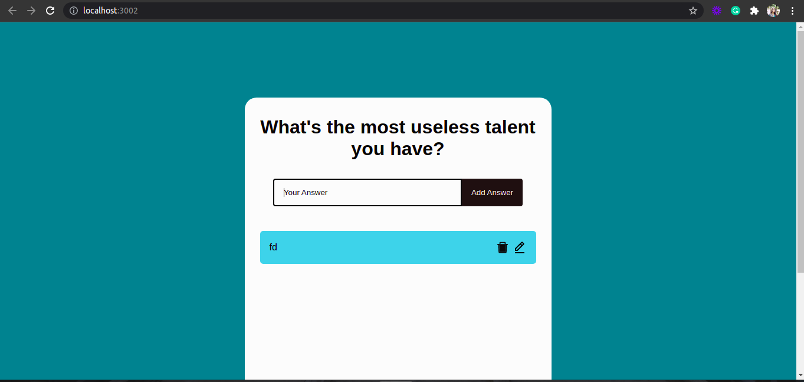

# todo-web-app
### Todo-react-app

> This project based on the task as per request in which create a todo web app using react.js.

## Built With

- React js

## Live Preview 

[Live Demo Link](https://kaneez98fatima.github.io/todo-web-app/)

## Author

👤 **Kaneez Fatima**

- GitHub: [@Kaneez98fatima](https://github.com/Kaneez98Fatima))

- LinkedIn: [@Kaneez98fatima](https://www.linkedin.com/in/kaneez-fatima-0a86601b3)

## 🤝 Contributing

Contributions, issues, and feature requests are welcome!

Feel free to check the [issues page](../../issues/).

## Show your support

Give a ⭐️ if you like this project!

## Acknowledgments

W3School
Codeacdemy

## 📝 License

[MIT licensed]

